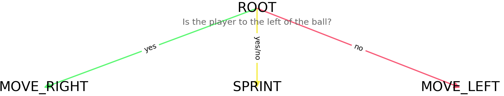

An arcade 1v1 football(soccer)/volley/basket game (single or local multiplayer). It can be played online [here](https://nuno-faria.itch.io/headtohead). It was made using the Unity game engine.


## Gameplay

The gameplay is straightforward: two players try to get the ball on the opposition's goal; the winner of the game is the one that reaches the goal limit first (if a limit was set).


### Demo


### Game Modes

There are three game modes available: football, volley and basket.

#### Football


#### Volley


There is a 7 second limit for how long the ball can be in the same area.
If the limit is exceeded, the other player scores a point.

#### Basket


### Abilities

The game offers three different abilities:

- **Kick** - kick the ball, with a specific power and direction;


- **Lift** - lift the ball (90 degrees angle);


- **Stop** - stop the ball;


## Controls

Both the keyboard and the controller are supported, although the controller is recommended way to play. The input used can be changed in the 'Controls' menu.


The menu can be navigated both with the mouse and the keyboard/controller. The goal limit can be changed selecting the input field and entering the number or using the vertical keys (W,S,up,down,LB).


## AI

The player's AI was implemented using the concept of **decision trees**. But instead of writing the functions and all the ifs/elses needed, it was used a YAML file to specify the tree. This file is then parsed by a Python script, that converts it to C# code. With this, the AI can be written faster (less boilerplate code) and it's easier to understand/manage.

### Specification

A specification file has three main fields:
- **include** - other specification files to include (relative path);
- **expressions** - aliases for expressions to be used in the nodes' specification;
- **nodes** - specification of the tree:
    - **info** - what the node does (to serve as documentation);
    - **action** - instructions to be executed before the decision is made (ex: setting variables);
    - **decision** - logic expression;
    - **yes** - nodes to execute (can be multiple) when the decision is true (or there is no decision);
    - **no** - nodes to execute (can be multiple) when the decision is false.


There are two dictionaries that must be provided to the tree:
- `state` - the state of the game;
- `data` - (empty) dictionary to set variables (to be used to pass the result and/or to use internally).

For example, let's say we want to create an AI that just follows the ball. The state provides us with the ball and the player's position. We could implement this AI like so (this could be simplified even further by having an action like `data["move"] = state["playerPosX"] - state["ballPosX"] < 0 ? 1 : -1`, it's just a simple illustrative example):

```yaml
expressions:
    # the expression is not needed, it's used just to make the code more readable
    left_of_ball: state["playerPosX"] < state["ballPosX"]

nodes:
    ROOT:
        info: Is the player to the left of the ball?
        decision: left_of_ball # or state["playerPosX"] < state["ballPosX"]
        yes: MOVE_RIGHT; SPRINT
        no: MOVE_LEFT; SPRINT

    MOVE_LEFT: data["move"] = -1
    # same as
    # MOVE_LEFT:
    #    action: data["move"] = -1

    MOVE_RIGHT: data["move"] = 1

    # the SPRINT node could be a ROOT action, since it's simple and always used
    SPRINT: data["sprint"] = 1
```

This results in the following tree (using the Assets/Scripts/AI/plot_specification.py script):



#### Trees Used

##### Football


##### Volley


##### Basket


### Execution

The structure is converted in instructions that adds the nodes to a tree, starting with the leaves and ending with the root. In runtime, the game `state` is passed to the tree, as well as the `data` dictionary. The result is provided using the reference to the `data`.